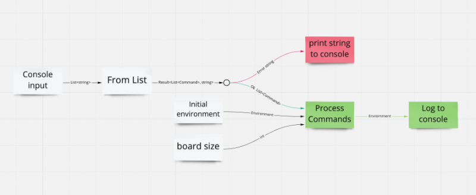

## Toy Robot

Toy Robot is an exercise to validate coding capability for interview participants. Here is my version of the coding challenge, written in FSharp.

## Getting Started

There is a small yak shave to get done and dusted before you can play around with the program yourself. I will link the relevant details here. I will assume you already have VSCode installed for the purpose of these instructions.

#### Step One: 
Install the [.NET SDK](https://dotnet.microsoft.com/en-us/download).

#### Step Two:
Go to VSCODE and select the Extensions icon and search for "Ionide":

The only plugin required for F# support in Visual Studio Code is Ionide-fsharp.

#### Step Three:
Go to the root directory of the project in your console and use these commands:

```
   dotnet restore
   dotnet run
```

Note here that dotnet restore is a first time setup kind of command, where dotnet run is what you want to do everytime you want to run the program. I have represented this further down in the Command section examples.

If you need more detailed instructions about setting up FSharp [you can find them here](https://docs.microsoft.com/en-us/dotnet/fsharp/get-started/install-fsharp).

#### Publishing Binaries

If you would like to publish a binary of the code and run it as a .exe on your machine use the appropriate command from this block in the root directory of the project.

```
dotnet publish -c release -r osx-x64

dotnet publish -c release -r win-x64

dotnet publish -c release -r linux-x64

dotnet publish -c release -r linux-arm
```

It's possible to run the program outside of the dotnet ecosystem by making an publishing a binary and navigating to it from your console. You could even give it your own files to crunch if you wanted to with something like the following block:

```
cat commands.txt | ./toy-robot
```

## Commands and design

The board is a 5 * 5 by default (starting at zero on both axis), so it should look like this in practice.

```
   4.0 4,1 4,2 4,3 4,4

   3,0 3,1 3,2 3,3 3,4

 y 2,0 2,1 2,2 2,3 2,4

   1,0 1,1 1,2 1,3 1,4

   0,0 0,1 0,2 0,3 0,4
            x
```

The robot will never leave these boundaries, although the boundaries themselves can be easily modified.

The console will take these commands as input:

    REPORT
    PLACE X,Y,F
    MOVE
    LEFT
    RIGHT
    RESET

I will now go through what each command does with examples.

#### REPORT
Report will print the current coordinates of the robot. It's worth noting that the environment starts empty. Whilever there is no robot in the environment, report will not print any information to the console. This is entirely by design.

Example:

```
❯ dotnet run
REPORT
```

No output is expected since there is no robot on the board.

#### PLACE X,Y,F 
Place puts the robot somewhere inside the boundaries. X and Y are it's coordinates and F is the direction it is facing on placement. After you've used the dotnet run command in your terminal the environment of the program will always by default be empty so this will very likely be the first command you use.

Example:

```
❯ dotnet run
PLACE 2,0,NORTH
REPORT

2,0,North
```

The robot hasn't moved anywhere from where you placed it, so the output will be the same as the placement variables.

```
❯ dotnet run
PLACE 2,0,NORTH
PLACE 0,3,WEST
REPORT

0,3,WEST
```

We overwrote the position of the robot from the first place with the second. So report sees the robot at 0,3,WEST.

#### MOVE
Move tells the robot to move one cell forwards in the direction it is facing.

Example:

```
❯ dotnet run
PLACE 2,0,NORTH
MOVE
REPORT

3,0,North
```

The robot moved north by one cell before we reported it.

```
❯ dotnet run
PLACE 2,0,NORTH
REPORT
MOVE

2,0,North
```

The robot moved forward by one cell after we reported it, so in this example the robot is at 3,0,NORTH like in the previous example, but we only see it at 2,0,NORTH.

#### LEFT / RIGHT 
Left and right turn the direction of the robot to it's left or right.

Example:

```
❯ dotnet run
PLACE 2,0,NORTH
LEFT
REPORT

2,0,West
```

```
❯ dotnet run
PLACE 2,0,NORTH
RIGHT
REPORT

2,0,EAST
```

```
❯ dotnet run
PLACE 2,0,NORTH
RIGHT
MOVE
REPORT

2,1,EAST
```

Note that the robot is now moving along the y axis as intended.

#### RESET
The reset command deletes the effects of all previous commands on the board.

Example:

```
❯ dotnet run
PLACE 2,0,NORTH
RIGHT
MOVE
REPORT
RESET
```

Note that no output is given. This is expected behaviour. The board has been reset. The robot was always just your imagination.

Here's a graph of what how the code behaves under the hood:



Have fun being a robot now! 
Author - Thomas John Cameron